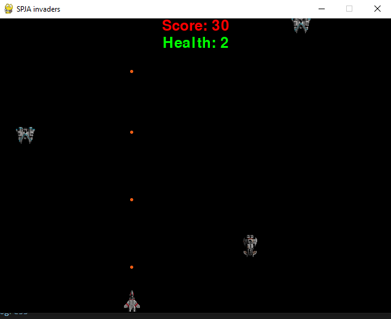

# VŠB - Python course 🐍

> <br>
> Python course which I made during my study time at university in Ostrava. There are tasks, solutions, power point slides for subject and cheatsheets. There is also one project programmed in Django.
> <br> <br>

<br/>

<p align="center">
  
</p>

<br/>

## How to run
```
You have to activate venv enviroment for proper operation.
```

<br/>

## List of all labs themes
|Order|Theme|
|-----|-----| 
|1    |Fizz Buzz |
|2    |Basic functions |
|3    |Basic functions 2 |
|4    |Vectors + Observable pattern|
|5    |Space Invaders|
|6    |Web Scrapper - Tweets|
|7    |Client - Server sockets communication |
|8    |Shortnest path for graph|
|9    |Tic-Tac Toe|
|10    |Django framework|
|11    |Machine learning|
|12    |Jupyter notebook|

